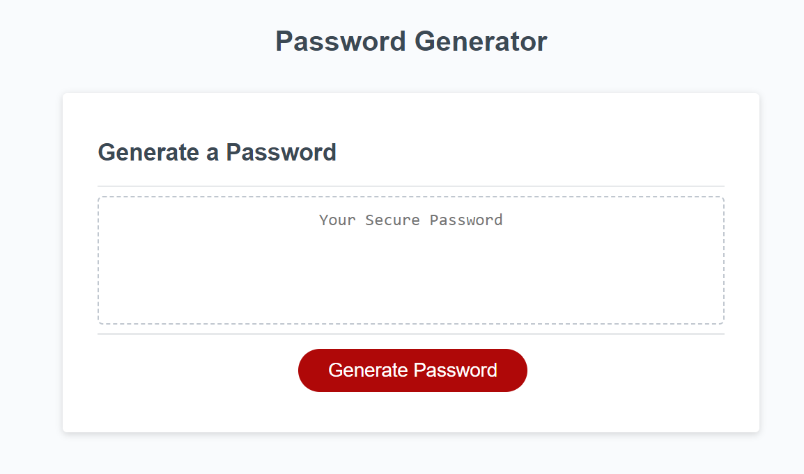

# Unit 5 Challenge: password-generator

## Contents
Description
Installation
Usage
Learnings / Future Work 
Credits
Licence
Screenshot

## Description

This application is intended for employee use. It will generate a random password based on criteria selected. 

Deployed Page: https://liamss.github.io/password-generator/ 
Github Repo: https://github.com/Liamss/password-generator

## Installation

Please open this in your favourite browser. 

## Usage

Please visit the URLs provided to see the latest deployed version

## Learnings / Future Work 

## Credits
N/A

## License
n/a

## Screenshot 

